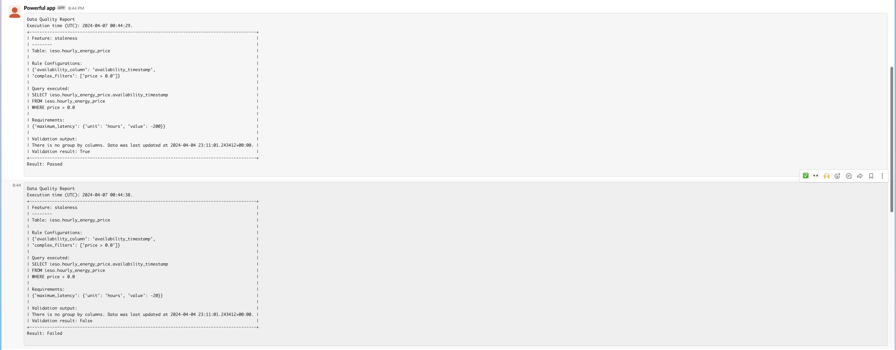

# Molly

[](https://github.com/flaviaouyang/molly/actions/workflows/pipeline-test.yml)

Molly is a data quality monitoring library specifically designed for time series data written in pure Python.

## Description

Molly is designed to monitor time series data in a SQL database such as MySQL or PostgreSQL.

Currently supported data quality feature:

- staleness: when the data was last updated
- completeness: whether any data is missing in a given date range

Currently support messaging service:

- Slack Web API

## Getting Started

### Installation

I strongly recommend using a virtual environment to install Molly.

Standard setup using pip:

```bash
cd molly
conda create -n "molly" python=3.12
conda activate molly
pip install .
```

Development setup using pip:

```bash
cd molly
conda create -n "molly" python=3.12
conda activate molly
pip install -e ".[dev]"
```

### Usage

1. As a standalone library:

```python
from molly import monitor_data_quality

if __name__ == "__main__":
    monitor_data_quality(
        data_quality_rules=data_quality_rules,
        sql_credentials=sql_credentials,
        monitor_platform_config=monitor_platform_config
    )
```

2. As a command line tool:

```bash
python -m molly <path_to_config_file>
```

### Configuration

The configuration file should be in JSON format and contain the following keys:

- data_quality_rules: a dictionary containing the data quality rules
  - supported features: completeness, staleness
  - Each feature rule should be a dictionary where the feature name is the key. Its value should be a list of user-defined rules where each rule should contain the following information:
    - `db_name`: the name of the database
    - `schema_name`: the name of the schema in the database
    - `table_name`: the name of the table in the database
    - `configurations`: a dictionary containing the configurations for the rule
    - `requirements`: a dictionary containing the requirements for the rule
- sql_credentials: a dictionary containing the SQL credentials
  - format: `database_name: SQL connection URI`
- monitor_platform_config: a dictionary containing the monitor platform configuration
  - required keys:
    - `messenger_name`: currently only supports `Slack Web API`
    - `messenger_credentials`: connection credentials for the messenger
    - `destination`: where the message will be sent

For more details, please refer to the example configuration file in the `doc` directory.

## Scheduling

1. Use a cron job to schedule the command line tool.
    - Example: `0 0 * * * python -m molly <path_to_config_file>`
2. Use an Airflow DAG to schedule the command line tool.

```python
from airflow import DAG
from airflow.decorators import task
from molly import monitor_data_quality

@task
def monitor_data_quality():
    monitor_data_quality(
        data_quality_rules=data_quality_rules,
        sql_credentials=sql_credentials,
        monitor_platform_config=monitor_platform_config
    )


with DAG(
    dag_id="molly_dag",
    schedule_interval="0 0 * * *",
    default_args=default_args,
    catchup=False,
) as dag:
    monitor_data_quality()
```
## Monitor Report



## License

This project is licensed under the MIT License - see the LICENSE.md file for details
